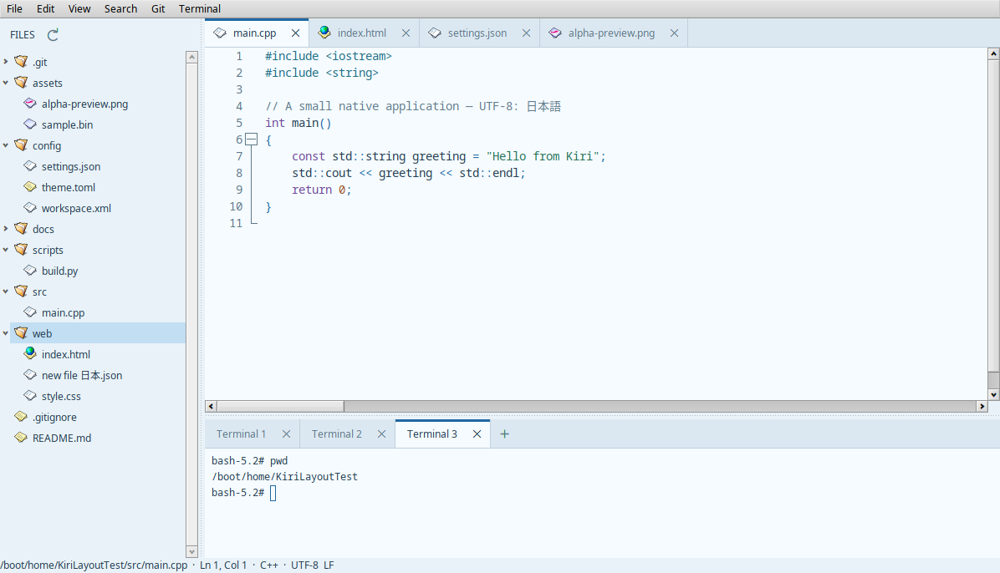
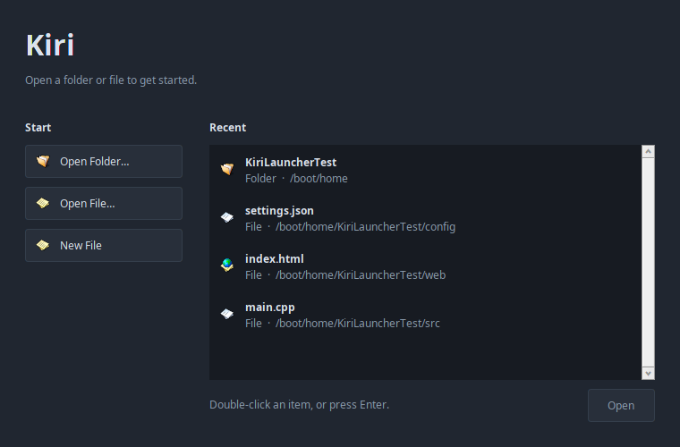
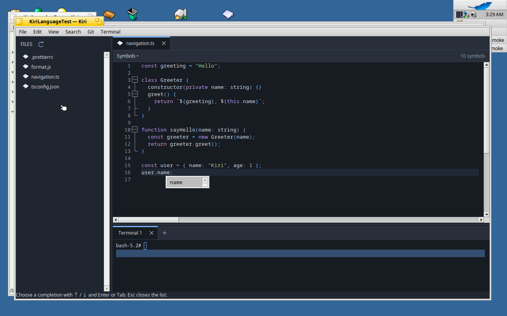
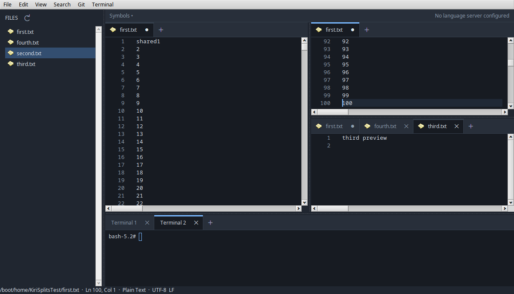

# Kiri


A native C++ project editor for Haiku, with a file tree, source editing, an
embedded terminal and a Git workspace. Kiri uses Haiku's Interface Kit,
Scintilla, Lexilla and libvterm. There is no browser or web UI runtime.

**0.0.1 alpha** is the first public release and runs on Haiku R1/beta5 x86_64. The application has
been exercised in QEMU/KVM, including real editing, staging and committing,
crash recovery, image previews and a 200 MiB document. See the
[verification record](docs/STATUS.md) and [performance measurements](docs/PERFORMANCE.md).



## Install or build

Download the Haiku x86_64 package from the
[0.0.1 alpha release](https://github.com/jmgasper/kiri/releases/tag/v0.0.1-alpha),
then install it on Haiku:

```sh
pkgman install ./kiri-0.0.1.alpha-1-x86_64.hpkg
/boot/system/apps/Kiri
```

Kiri also appears in Deskbar's Applications menu. The package declares its
Scintilla, Lexilla and Git dependencies. It is an x86_64 Haiku executable;
the Linux host builds the portable core and tests only.

To build from source on Haiku:

```sh
pkgman install gcc make scintilla_devel lexilla_devel git
make -j4
make check check-native check-language
./build-haiku/Kiri /path/to/project
make package
```

The Makefile is verified with GCC 13.3 and the tools bundled with R1/beta5,
Scintilla 5.3.4 and Lexilla 5.4.6. Some current HaikuPorts compiler packages
require a newer Haiku release; beta5's Installer provides compatible development
tools. Use packages matching your OS. A CMake 3.18+ build is also provided;
the native release artifact is built with the Makefile.

## Launcher

Starting Kiri shows a compact launcher with **Open Folder…**, **Open File…**,
**New File** and the 24 most recent folders and files. Recent items show their
native icon, name and location; double-click one, or select it and press Enter.
The list persists across restarts and initially includes the previous session.
Unavailable items can be removed from the list without deleting files.

Choosing the previous project restores its saved tabs and editor positions.
Opening a file or folder from Tracker or the command line goes straight to the
workspace. To open a project from Tracker, right-click its folder and choose
**Open with → Kiri**. Unsaved documents from an interrupted session recover immediately.
**File → Show Launcher…** brings the launcher back while you work; opening
another item there preserves your existing tabs. The launcher follows your theme.



## Formatting and language tools

Right-click source text for **Format with Prettier**. Formatting uses unsaved
text and project settings, creates one undo step, and leaves saving to you.
**Ctrl+Space** or **Complete Code** requests language-server suggestions;
suggestions also appear while typing. Choose with Up/Down and Enter or Tab.

The **Symbols** bar above the editor panes lists variables, fields, classes, methods
and functions and jumps to their declarations. It follows the active file and
updates from unsaved text. **Edit → Language Tools…** configures Prettier,
language-server commands and automatic suggestions.

```sh
pkgman install nodejs20 npm
bash tools/install-language-tools.sh
pkgman install llvm16_clang   # clangd for C and C++
```

The setup script installs Prettier and JavaScript, TypeScript, HTML, CSS and
JSON servers in Kiri's settings directory. See the [language tools guide](docs/LANGUAGE_TOOLS.md)
for project-local versions, other languages, configuration and limits.



## Workspace



- **File → Open Folder…** sets the lazy file tree, project index, Git repository and
  terminal directory. Expand folders and double-click files to open them.
  The window title shows the project folder. **View** contains controls for
  showing and hiding the file tree, terminal and source control workspace.
  The refresh icon beside **FILES** picks up files created outside Kiri.
  The tree and document tabs show Haiku's native icons for source files, text,
  web pages, images, archives and other basic file types, with a generic fallback.
- Tabs show unsaved dots and close controls. Scroll the tab strip to reveal
  additional documents. Drag editor tabs to reorder them, move them to another
  pane, or drop them outside the window to open them in a new window. The
  insertion line shows where a tab will land; Escape cancels the drag.
  Right-click any document or terminal tab for **Close all**
  and **Close others**; the latter keeps the tab you clicked. Unsaved documents
  keep their save prompts, and Cancel stops the remaining closes.
  Editing includes undo/redo, multiple selections, folding,
  indentation, line numbers, wrapping, zoom, find/replace and go to line.
- **View → Split Right / Split Down** creates nested editor panes, each with its
  own tabs. Views of the same file share edits, undo, saves and recovery while
  keeping independent selections, scrolling, wrapping, folding and zoom.
  The active pane receives find, formatting, symbols and completion commands.
- **View → Preview Tabs** lets tree and search selections reuse one italic
  preview tab per pane. Editing, double-clicking the tab or **File → Keep Open**
  makes it permanent. **File → Reopen Closed Tab** restores recently closed saved
  files and their positions. See [editor panes and tab workflows](docs/EDITOR_PANES.md)
  for shortcuts, session restoration and close/reopen policies.
- **Search → Open Quickly…** searches file paths. **Search Project** finds literal text
  and opens a result at its line and column. Newer queries cancel older work.
- **Edit → Preferences…** (Alt+,) opens editor preferences. Choose an installed
  font, a size from 8 to 48 points, and a theme with a live code preview.
  **Apply** or **OK** updates open files, new documents and Git diffs; **Cancel**
  discards unapplied choices, and **Restore Defaults** previews the original
  font, size and theme. Preferences persist between sessions.
- Five dark themes are available: **Obsidian, Nord, Midnight, Forest and Ember**.
  Five light themes are available: **Daylight, Linen, Glacier, Rose and Meadow**.
  **View → Color Theme** also changes the theme directly. Window position,
  nested pane layouts, open saved files, selections and scroll positions persist
  between sessions.
- Lexilla supplies highlighting for C/C++, Python, JavaScript/TypeScript, HTML,
  JSON, XML, CSS, Java, C#, Rust, shell, SQL, Markdown, YAML, TOML, and more.
  A few related languages use an approximate C-family lexer.
- Images use installed Haiku translators, a transparency checkerboard and
  fit/actual-size modes. Double-click to switch size; drag to pan at actual size.
  Other binary formats open as read-only, bounded hex previews.
- The terminal panel uses the same tabs as the editor. **+** or
  **Terminal → New Terminal** opens another independent shell in the current
  project directory. Tabs retain their directory, variables and scrollback while
  other sessions run. Changing projects starts a new tab and preserves existing
  shells. Close a session with its tab’s close control; closing the last session
  hides the panel, and **Terminal → Show / Hide** opens it again.
- Each terminal is a real PTY with UTF-8, ANSI colors, scrollback and alternate-screen
  programs. Drag across rows to select output; Copy and Paste use the system clipboard.

Haiku's default Command modifier is **Alt**. Menus show configured shortcuts:
Alt+P opens files quickly, Alt+F opens find/replace, Alt+Shift+F searches the project,
Alt+G goes to a line, Alt+S saves, Alt+Shift+T opens a terminal, and Alt+W closes
the focused terminal or document tab. In the find bar,
Enter in the replacement field replaces one match; **All** replaces every match
as one undo action. Terminal control sequences use **Ctrl**, including Ctrl+C
and Ctrl+D.

## Git

The **Git** workspace shows changed files, staging controls, a commit-message
field, a branch/merge graph and syntax-colored patches. Select a changed file
to inspect working-tree or staged changes; select a commit for its metadata and
patch. **Load More** continues through all reachable history in 200-commit pages.
**Git → File History** filters history to the active file, including renames.
Fetch, fast-forward-only pull and push use the installed Git and its configured
credentials. Errors appear in the workspace.

**Git → Copy GitHub Permalink** copies an immutable commit URL for the active
line or selected line range. SSH and HTTPS GitHub remotes and escaped paths are
supported. Save edits first: unchanged lines map back to HEAD, while changed
lines need a commit. Untracked files need staging before their added-line patch
can be inspected. Merge commits show a patch against the first parent.

## Files, recovery and limits

Saves take a consistent snapshot, write and flush a temporary file beside the
destination, check for external changes and rename into place. Existing file
permissions and Haiku attributes are preserved; symlinks resolve to their
targets. New files use private permissions (0600). UTF-8, optional UTF-8 BOM,
and existing CRLF/CR/LF bytes are preserved. Other encodings open read-only.

Unsaved drafts are periodically captured after about ten seconds and restored
after an abnormal exit. Large snapshots are copied in chunks and retried if
editing changes the document. Recovery is periodic, so the most recent edits
may not yet be captured. Preferences and private draft files live in
`~/config/settings/Kiri/`. Save/close removes obsolete drafts; cancelling a quit
keeps all remaining documents' dirty state.

The measured 200 MiB file loaded on a worker in **504 ms**, then attached to the
editor in **0.48 ms**. A 100,001-file project indexed in **825 ms** and a fuzzy
query took **13 ms** in the test VM. These are warm-cache measurements, with
details and reproduction commands in [PERFORMANCE.md](docs/PERFORMANCE.md).

- Highlighting and style storage are disabled above 8 MiB. The text limit is
  1 GiB, subject to memory; explicit saving needs an additional full text snapshot.
- Project indexing is capped at 500,000 paths; quick-open returns 100 candidates.
  Project search returns up to 2,000 matches and skips binary files, symlinks and
  files over 32 MiB. Git command output is capped at 32 MiB.
- The tree loads directories individually. A single directory with an extreme
  number of direct children and very long text lines need further measurement.
- Terminal selection covers whole rows. PDF/video viewers, text-encoding
  conversion, debugging and an extension system are outside this alpha.
- Git remote authentication uses existing credentials; there is no login dialog
  or interactive merge-conflict editor.

## Tests and development

The portable suite runs on Linux and Haiku and covers actual temporary Git
repositories, file conflicts and preservation, recovery corruption, cancellation,
line mapping, project search, terminal emulation and a real PTY shell:

```sh
cmake -S . -B build-host -DCMAKE_BUILD_TYPE=Debug
cmake --build build-host -j8
ctest --test-dir build-host --output-on-failure
```

The current suites pass **163 core checks**, **233 Haiku editor/file/worker checks**
and **264 native workspace checks** (`make check-workspace`).
Language checks include real Prettier and TypeScript servers: **98 checks** on
Linux and **108 on Haiku**, where clangd C++ completion and symbols are also exercised:

```sh
make check-language
build-haiku/kiri_language_tests --tools /boot/home/config/settings/Kiri
```

Native visual and interaction checks are recorded separately in
[STATUS.md](docs/STATUS.md). The isolated VM and build workflow is documented in
[VM.md](docs/VM.md); machine state and SSH keys are ignored by Git.

[Future feature proposals](docs/futures_features/README.md) compare CodeEdit,
CotEditor and historical Fleet features with Kiri, with individual drafts for
review before implementation.

## Dependencies and attribution

Kiri is MIT-licensed. Scintilla and Lexilla are system libraries under the
[Scintilla license](https://www.scintilla.org/License.txt).
Unmodified libvterm 0.3.3 is vendored under its MIT license; see
[the pinned source](vendor/libvterm/UPSTREAM.md) and [license](vendor/libvterm/LICENSE).
JSON for Modern C++ 3.12.0 is also vendored under MIT; see its
[pinned source](vendor/nlohmann/UPSTREAM.md) and [license](vendor/nlohmann/LICENSE.MIT).

The workspace organization takes inspiration from
[Nova](https://help.nova.app/projects/workspace/) and Xcode. Kiri uses its own UI;
no assets from those applications are distributed.
