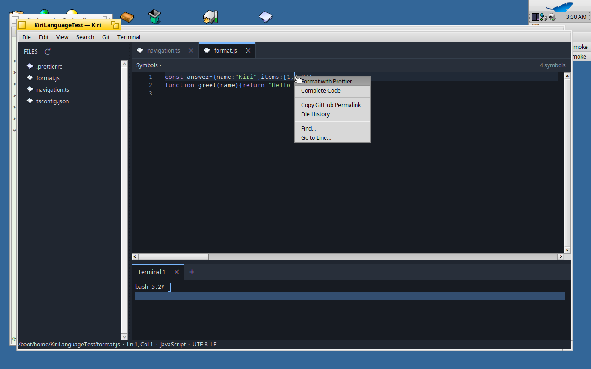
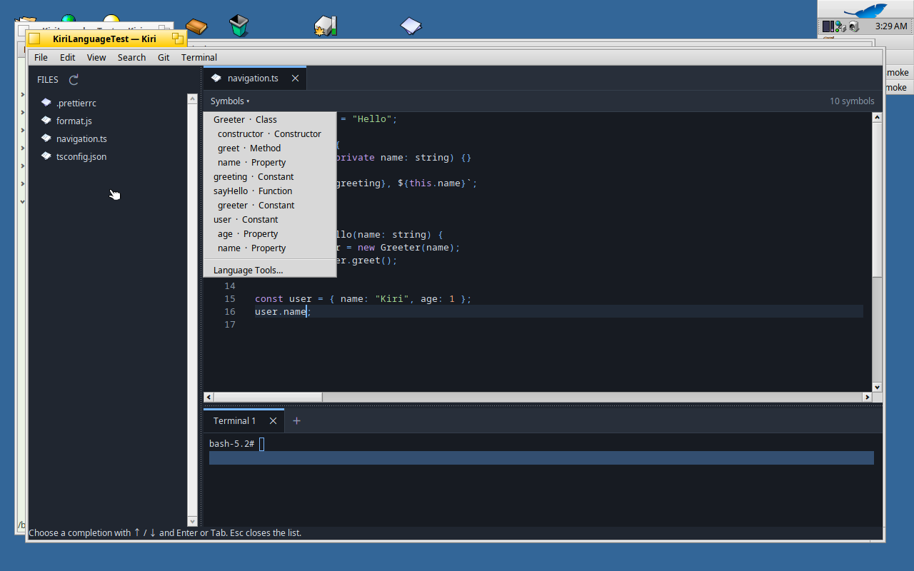
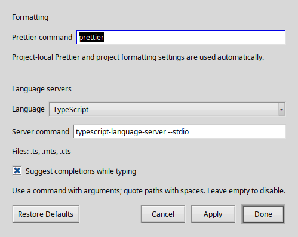

# Formatting, completion and file symbols

Right-click source text and choose **Format with Prettier**. Kiri sends the
current editor buffer to Prettier with the file's path, so project configuration,
plugins and ignore rules apply. Formatting is a single undoable edit. Save writes
the formatted text to disk. If you edit or close the file while Prettier runs,
its older result cannot replace your changes. Save untitled documents with an
extension first so Prettier can choose a parser.



Language servers provide **Complete Code** in the editor context menu and
**Edit** menu. **Ctrl+Space** requests completion; typing also requests suggestions.
Use Up/Down and Enter or Tab to choose, or Escape to dismiss. Completion respects
server replacement ranges and additional edits such as imports, with one undo
step. Kiri requests plain text completions rather than snippet placeholders.

The **Symbols** bar above the editor lists the current file's variables, fields,
classes, methods and functions, as supplied by its language server. Click a
symbol to jump to its declaration, including folded code. The bar follows the
active tab and shows the enclosing symbol as the caret moves.
**Search → Go to Symbol…** (Alt+Shift+R) opens the same list.



## Install tools on Haiku

Install compatible Node.js and npm packages, then run the supplied setup script:

```sh
pkgman install nodejs20 npm
bash tools/install-language-tools.sh
```

The script installs Prettier 3.9.6, TypeScript 5.9.3,
typescript-language-server 4.3.4 and vscode-langservers-extracted 4.10.0 under
`/boot/home/config/settings/Kiri/tools`. An optional first argument selects a
different Kiri settings directory. For an installed HPKG the script is in
`/boot/system/documentation/packages/kiri/tools/`.

For C and C++, install a Haiku `clangd` package, such as `llvm16_clang`.
Supply your project's `compile_commands.json` so clangd can find its headers
and compiler options; CMake can generate it with
`-DCMAKE_EXPORT_COMPILE_COMMANDS=ON`. See [clangd project setup](https://clangd.llvm.org/installation#project-setup).
Other built-in profiles use `pylsp` (Python), `rust-analyzer` (Rust) and `gopls`
(Go). Install the servers you use. The bar reports missing tools; **Language
Tools…** in its menu opens the settings.

**Edit → Language Tools…** lets you change the Prettier command and each language
server command, disable a server by leaving its command empty, and toggle
automatic suggestions. Apply restarts language services for open documents.
Commands accept quoted paths and literal arguments; they do not run through a
shell. Executables are found in the file's ancestor `node_modules/.bin`
directories, Kiri's tools directory, then `PATH`. An explicit path overrides
this search. Project-local versions therefore take precedence by default.



TypeScript's optional automatic `@types` downloader does not support Haiku.
The default TypeScript profiles disable it. Types installed in the project
remain available to the server.

## Additional languages and server settings

`/boot/home/config/settings/Kiri/language-tools.json` stores the commands and
profiles. Each server entry contains `name`, the LSP `language` identifier,
`extensions`, `command`, `initializationOptions` and `configuration`. Add profiles
there for other stdio language servers, then choose **Edit → Language Tools… →
Apply** after reopening the dialog. The `configuration` object answers LSP
`workspace/configuration` requests, including sections such as `python.analysis`.

Kiri implements LSP initialization and shutdown, document open/change/save/close,
UTF-8 and UTF-16 position negotiation, full and incremental synchronization,
completion and completion resolution, and both hierarchical and flat document
symbols. It also supports [push diagnostics and full semantic tokens](LANGUAGE_ANALYSIS.md),
and [previewed symbol rename](SEARCH_AND_REFACTORING.md). General server-initiated
workspace edits, pull diagnostics and code actions are not enabled.

Language tools run asynchronously. Both formatting and language services are
limited to source files up to 8 MiB, leaving Kiri's larger-file editing path
available. Server messages, output, queued work and requests are bounded.

References: [Prettier CLI](https://prettier.io/docs/cli),
[Language Server Protocol 3.17](https://microsoft.github.io/language-server-protocol/specifications/lsp/3.17/specification/),
[TypeScript language server](https://github.com/typescript-language-server/typescript-language-server).

## Symbol rename

**Edit → Rename Symbol…** previews a language-server rename across source files,
including unsaved buffers. Apply checks snapshots before changing files;
**Undo Last Project Edit…** restores the operation, including closed-file writes.
See [search and refactoring](SEARCH_AND_REFACTORING.md) for supported edits,
name validation, save behavior and recovery.
